# 类图与时序图

## 1. 类图

### 1.1 ADT 模块

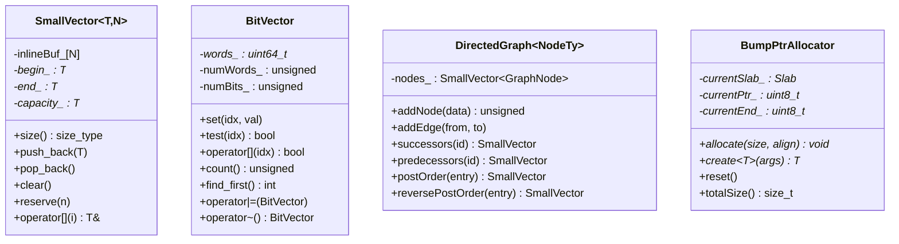

### 1.2 AIR 模块

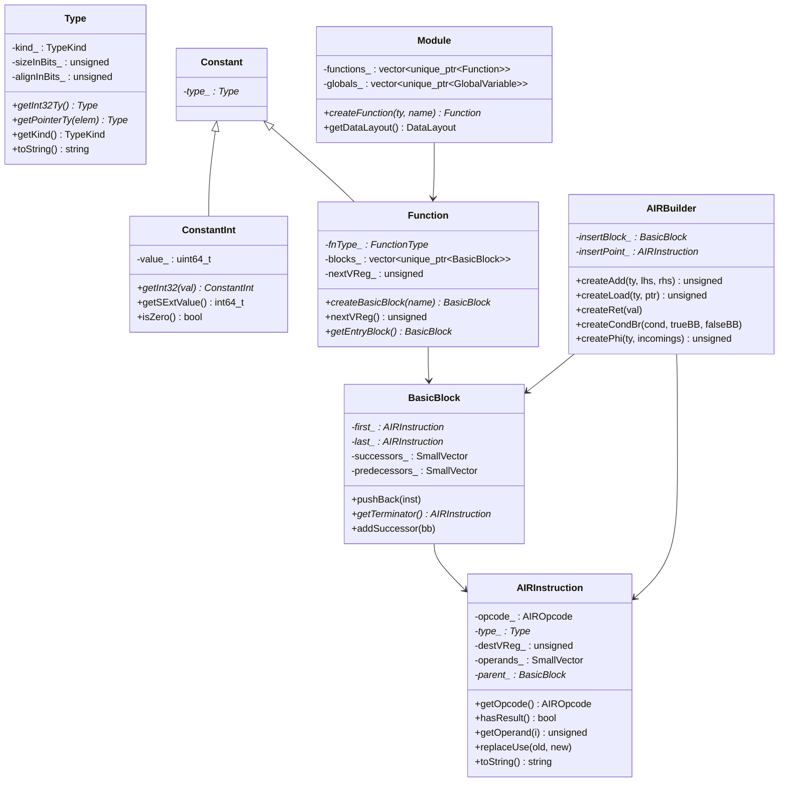

### 1.3 Target 模块

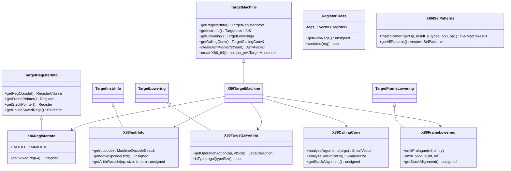

### 1.4 CodeGen 模块

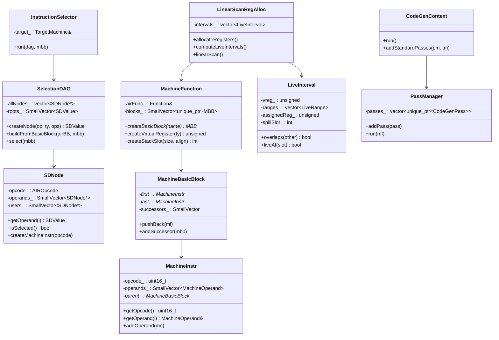

### 1.5 MC 模块

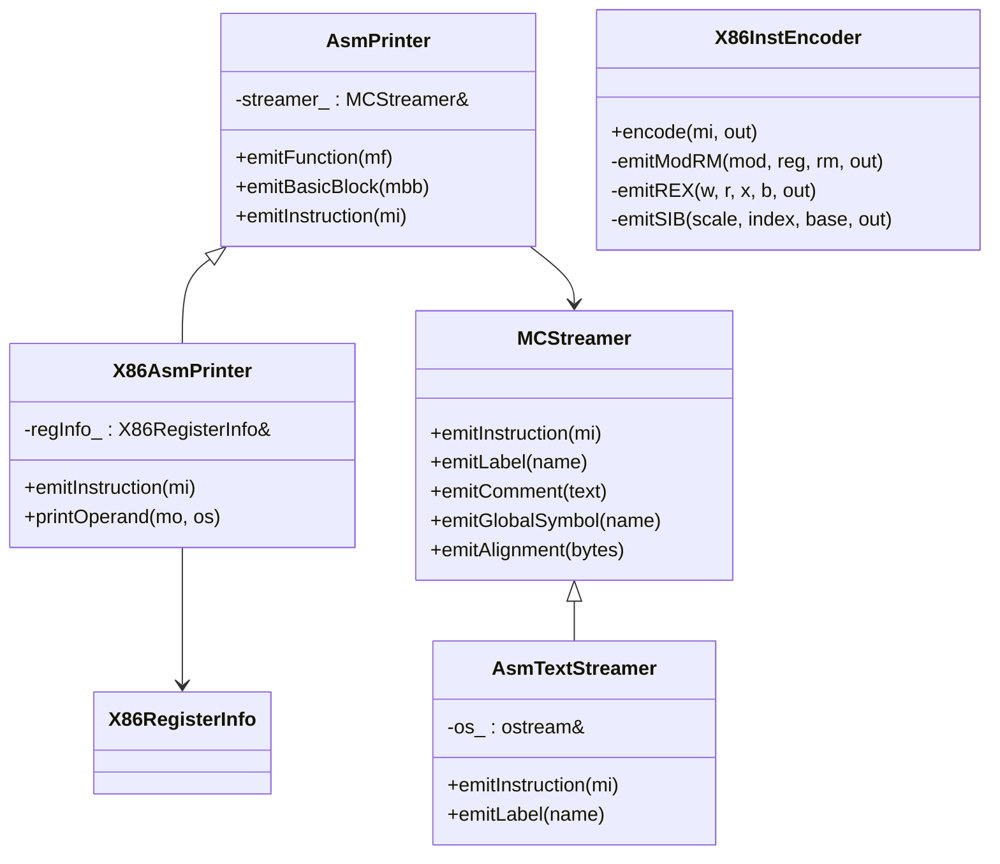

---

## 2. 时序图

### 2.1 完整编译流程

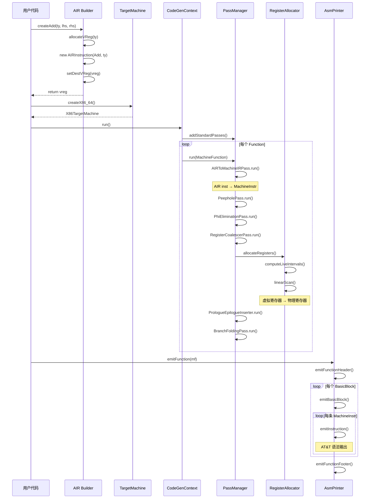

### 2.2 指令选择流程

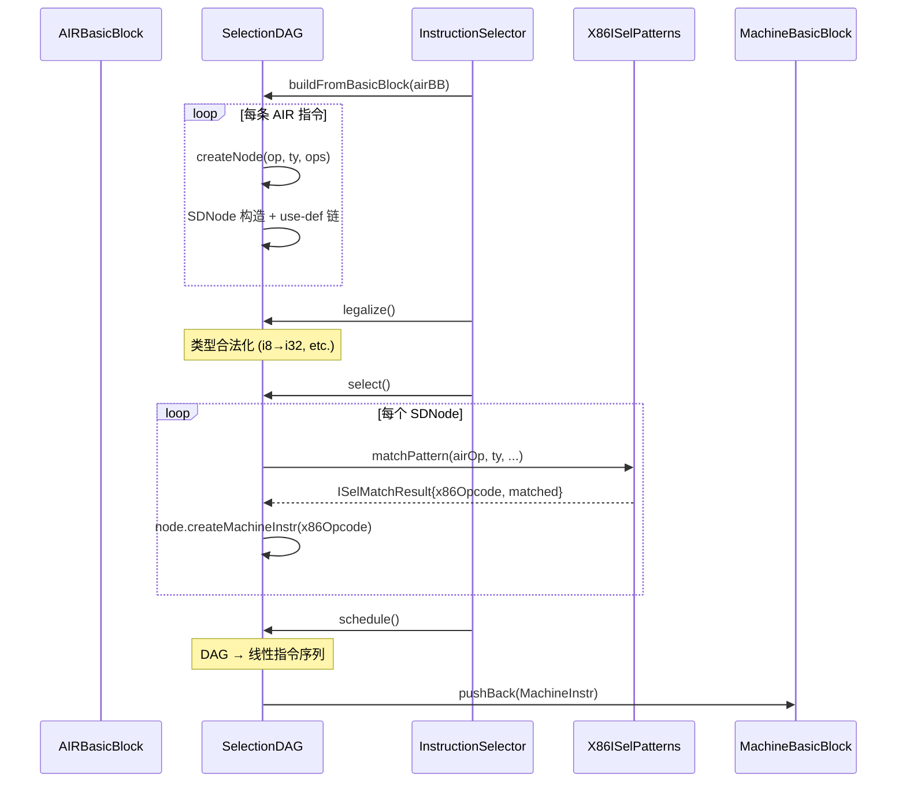

### 2.3 寄存器分配流程

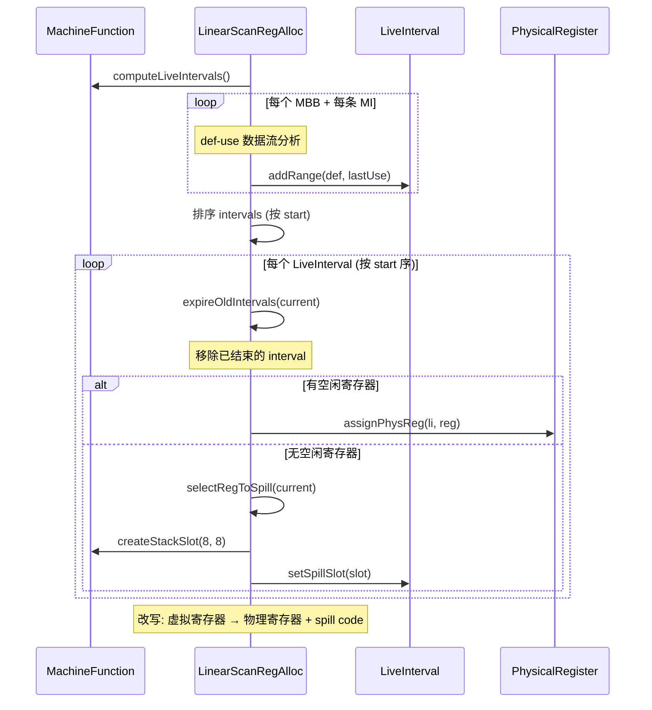

### 2.4 x86-64 栈帧布局

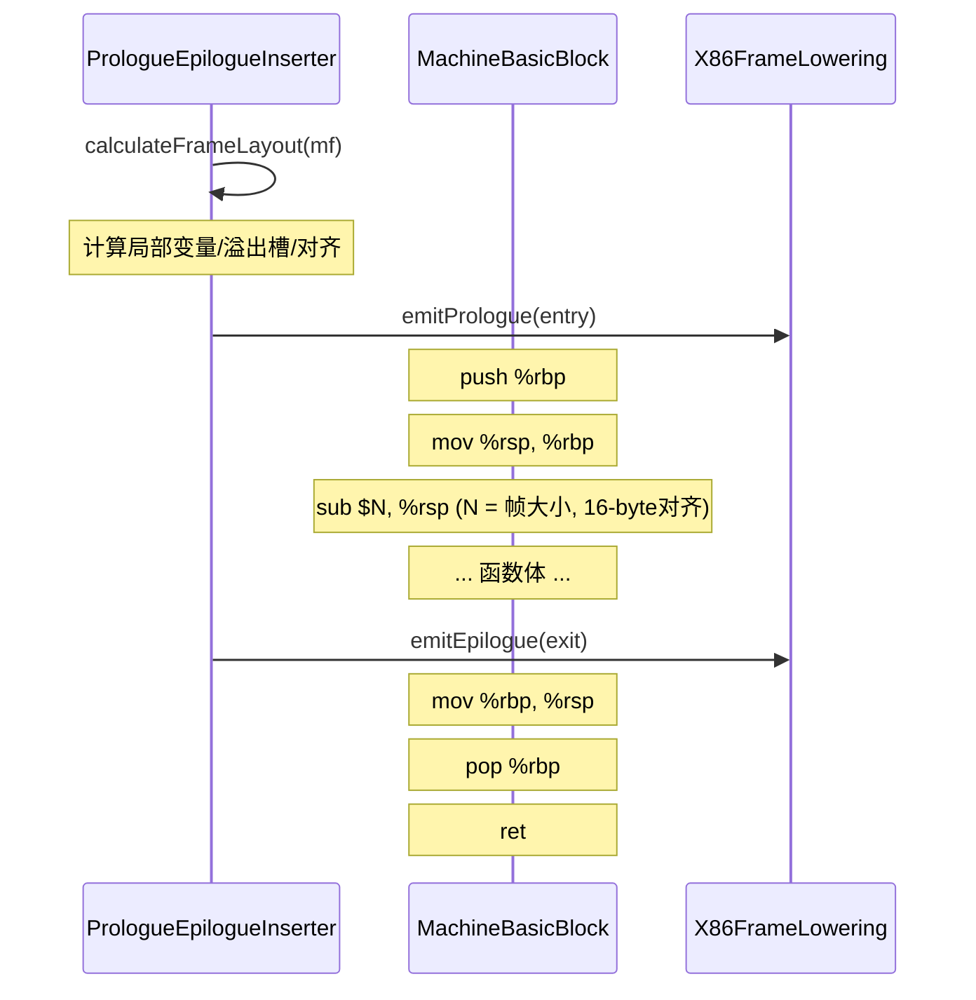

### 2.5 System V AMD64 调用约定

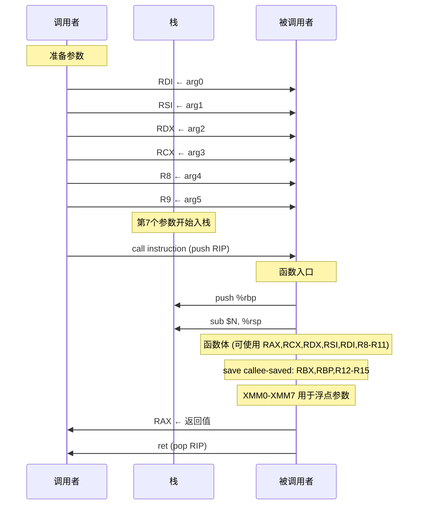

---

## 3. 完整管线图

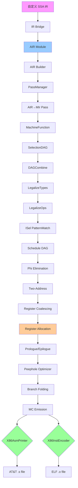
