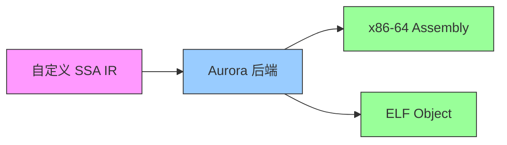

# Aurora — Production-Grade x86-64 Compiler Backend

[](../LICENSE)
[](https://en.cppreference.com/w/cpp/17)
[](https://cmake.org)
[](#)
[](#)

**Aurora** 是一个面向编译器项目的 **生产级 x86-64 后端代码生成框架**，设计参考 LLVM 架构，支持自定义 SSA IR 到 x86-64 汇编的全流程转换。

---

## 核心能力



| 能力 | 状态 |
|------|------|
| SSA 中间表示 (50条细粒度指令) | 完成 |
| x86-64 目标描述 (寄存器/指令/ABI) | 完成 |
| 指令选择 (SelectionDAG + 模式匹配) | 完成 |
| 寄存器分配 (Linear Scan) | 完成 |
| 栈帧管理 (Prologue/Epilogue) | 完成 |
| AT&T 汇编输出 | 完成 |
| x86-64 二进制编码 (ModRM/SIB/REX) | 完成 |
| Pass 管线 (可组合优化 pass) | 完成 |
| GoogleTest 单元测试 (140+ cases) | 完成 |
| Google Benchmark 性能基准 | 完成 |

## 快速开始

```bash
# 配置 & 构建
cmake -B build -S . -DAURORA_BUILD_TESTS=ON -DAURORA_BUILD_BENCHMARKS=ON
cmake --build build -j8

# 运行测试
ctest --test-dir build

# 运行编译器
./build/tools/aurorac/aurorac

# 运行基准测试
./build/tests/AuroraBench
```

## Hello World 示例

```cpp
#include "Aurora/Air/Module.h"
#include "Aurora/Air/Builder.h"

auto module = std::make_unique<Module>("hello");
SmallVector<Type*, 8> params = {Type::getInt32Ty(), Type::getInt32Ty()};
auto* fnTy = new FunctionType(Type::getInt32Ty(), params);
auto* fn = module->createFunction(fnTy, "add");

AIRBuilder builder(fn->getEntryBlock());
unsigned sum = builder.createAdd(Type::getInt32Ty(), 0, 1);
builder.createRet(sum);
```

## 架构概览

```
┌──────────────────────────────────────────────┐
│                 你的前端 IR                    │
│             (SSA / CFG)                       │
├──────────────────────────────────────────────┤
│            IR Bridge (IRAdapter)             │ ← 你实现
├──────────────────────────────────────────────┤
│              ┌────  Aurora  ────┐            │
│              │   AIR (通用 IR)    │            │
│              ├──────────────────┤            │
│              │ Target Description│            │
│              │ (X86 RegisterInfo │            │
│  ┌──管线───→│  InstrInfo, ABI)  │            │
│  │           ├──────────────────┤            │
│  │           │  SelectionDAG    │            │
│  │           │  + ISelPatterns  │            │
│  │           ├──────────────────┤            │
│  │           │  RegisterAlloc   │            │
│  │           │  (Linear Scan)   │            │
│  │           ├──────────────────┤            │
│  │           │  Prologue/       │            │
│  │           │  Epilogue        │            │
│  │           ├──────────────────┤            │
│  │           │  MC Emission     │            │
│  │           │  (AsmPrinter +   │            │
│  │           │   Encoder)       │            │
│  │           └──────────────────┘            │
│  │                    │                      │
│  └────────────────────┘                      │
├──────────────────────────────────────────────┤
│           x86-64 .s  / ELF .o                │
└──────────────────────────────────────────────┘
```

## 模块依赖

```
ADT ← Air ← Target ← X86 ← CodeGen ← MC ← aurorac
```

每个模块独立编译为静态库 + 动态库。

## 性能

| 操作 | 耗时 |
|------|------|
| 指令选择匹配 (单条) | 11 ns |
| 指令选择匹配 (全部30条) | 262 ns |
| BitVector Set | ~3 ns/bit |
| SmallVector PushBack | ~2 ns/elem |

## 许可证

MIT License — 详见 [LICENSE](../LICENSE)

## 更多文档

- [架构设计](ARCHITECTURE.md)
- [类图与时序图](DIAGRAMS.md)
- [需求分析](REQUIREMENTS.md)
- [模块设计](MODULES.md)
- [API 参考](API_REFERENCE.md)
- [用户手册](USER_GUIDE.md)
- [开发者指南](DEVELOPER_GUIDE.md)
- [完整示例](EXAMPLES.md)
